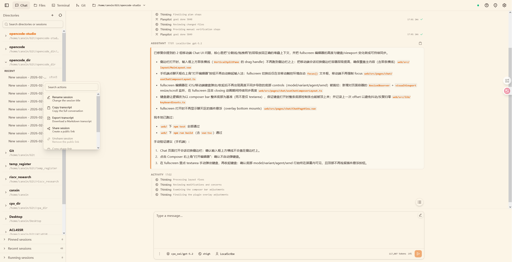
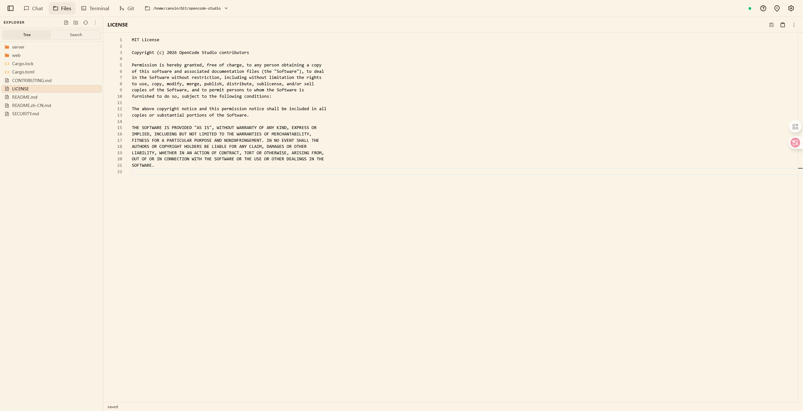
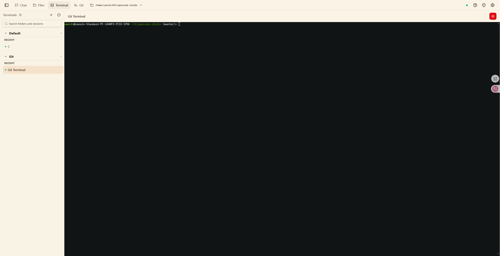
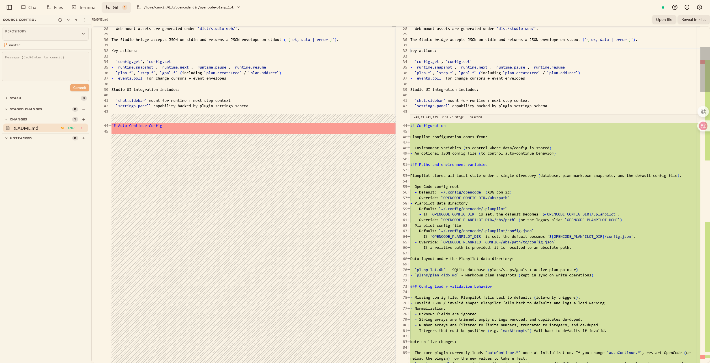
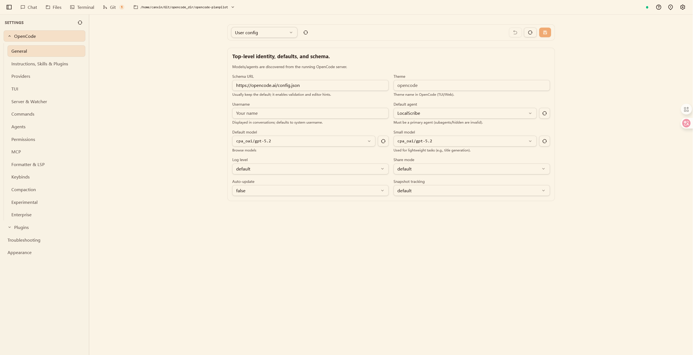

# OpenCode Studio

[English](README.md) | 简体中文

OpenCode Studio 是一个面向 OpenCode 的本地优先 Web UI。它运行一个 Rust (Axum) 服务端：负责托管构建后的 Vue 前端资源，并将请求桥接/代理到 OpenCode 服务（`opencode serve`）。

> 说明：本项目为社区实现，非 OpenCode 团队官方项目，与其不存在官方隶属关系。OpenCode 上游项目：https://github.com/anomalyco/opencode

<p align="center">
  
</p>

## 页面展示

<details>
<summary><strong>界面截图</strong>（点击展开）</summary>

<p align="center">
  <a href="assets/studio-chat.png"></a>
  <a href="assets/studio-files.png"></a>
  <a href="assets/studio-terminal.png"></a>
  <a href="assets/studio-git.png"></a>
  <a href="assets/studio-settings.png"></a>
</p>

</details>

- 聊天页面：会话管理、消息流、工具调用可视化。
- 文件页面：工作区浏览、编辑、搜索/替换。
- 终端页面：集成 PTY 终端，支持常见命令操作。
- Git 页面：状态查看、差异对比、分支/worktree 辅助。
- 设置页面：OpenCode 配置层与 Studio 本地配置集中管理。

## 功能介绍

- 多面板协同：聊天、文件、终端、Git 在一个工作区内联动。
- OpenCode 事件流桥接：支持实时流式消息和会话恢复。
- 配置可视化：可在设置页读取与编辑多层配置。
- 插件交互入口：可加载插件 UI 描述并触发插件动作。

## 特性介绍

- 性能优化链路：在代理层进行事件裁剪、结果精简与传输减负，降低长会话卡顿。
- 分页机制：会话列表、消息列表、目录列表等核心数据走 `offset`/`limit` 分页，减少首屏压力。
- 懒加载策略：较重内容按需请求与展开，避免一次性加载全部上下文。
- 独有插件 UI 系统：从 `opencode.json` 发现插件，加载 `studio.manifest.json` 并在 UI 中提供可操作入口。
- 本地优先与可运维：既能桌面安装即开即用，也能以系统服务稳定常驻。

## 前置依赖

- 所有平台都需要提前安装 OpenCode CLI，再安装/运行 Studio 服务。
- Windows 服务安装依赖 `sc.exe`（Windows 标准组件内置），并需使用管理员权限 PowerShell。
- Linux 想使用系统服务管理时，需要 `systemctl`。

先安装 OpenCode（任选一种方式）：

```bash
# macOS / Linux（官方安装脚本）
curl -fsSL https://opencode.ai/install | bash

# macOS / Linux（Homebrew）
brew install anomalyco/tap/opencode
```

```powershell
# Windows（Scoop）
scoop install opencode

# Windows（Chocolatey）
choco install opencode

# 任意平台（已安装 Node.js）
npm i -g opencode-ai@latest
```

安装 Studio 服务前建议先确认：

```bash
opencode --version
```

## 快速安装

你可以按场景选择两种安装方式：

### 方式一：安装包安装（Desktop App）

适合本机桌面使用（开箱即用）。

1. 打开 [GitHub Releases 页面](https://github.com/canxin121/opencode-studio/releases/latest)
2. 按系统下载安装包：
   - Windows：`.msi` / `.exe`
   - macOS：`.dmg`
   - Linux：`.AppImage` / `.deb` / `.rpm`
3. 安装并启动应用后，内置后端 sidecar 会自动启动。

### 方式二：服务安装（Service）

适合服务器、开发机常驻、或需要用 `systemd` / `sc` 统一管理的场景。

Unix（Linux/macOS）：

```bash
# 服务安装（含内置 UI）
curl -fsSL https://raw.githubusercontent.com/canxin121/opencode-studio/main/scripts/install-service.sh | bash -s -- --with-frontend

# 服务安装（仅 API，不带内置 UI）
curl -fsSL https://raw.githubusercontent.com/canxin121/opencode-studio/main/scripts/install-service.sh | bash
```

Windows PowerShell（管理员权限）：

```powershell
# 服务安装（含内置 UI）
iex "& { $(irm https://raw.githubusercontent.com/canxin121/opencode-studio/main/scripts/install-service.ps1) } -WithFrontend"

# 服务安装（仅 API，不带内置 UI）
iex "& { $(irm https://raw.githubusercontent.com/canxin121/opencode-studio/main/scripts/install-service.ps1) }"
```

## 安装后：如何在浏览器访问

- 服务默认地址是 `http://127.0.0.1:3000`（由配置里的 `host` + `port` 决定）。
- 如果是“含内置 UI”安装，直接打开 `http://127.0.0.1:3000`。
- 如果是“仅 API”安装，可访问 `http://127.0.0.1:3000/health` 确认服务是否正常。
- 仅 API 模式想启用网页 UI，可在 `opencode-studio.toml` 中设置 `ui_dir` 指向有效的 `dist` 目录，或重新用 `--with-frontend` / `-WithFrontend` 安装。
- 需要远程机器访问时，把 `host` 改为 `0.0.0.0`，重启服务后通过 `http://<服务器IP>:3000` 访问。

## 安装后：如何调整配置文件

### 服务安装

安装完成后会生成 `opencode-studio.toml`：

- Unix：`~/opencode-studio/opencode-studio.toml`
- Windows：`%USERPROFILE%\\opencode-studio\\opencode-studio.toml`

可直接修改 `[backend]` 下的关键项，例如监听地址、端口、UI 路径、OpenCode 连接方式：

```toml
[backend]
host = "127.0.0.1"
port = 3000
skip_opencode_start = false
opencode_host = "127.0.0.1"
# opencode_port = 16000
# ui_dir = "/absolute/path/to/web/dist"
```

修改后重启服务生效：

- Linux 用户服务：`systemctl --user restart opencode-studio`
- Linux 系统服务：`sudo systemctl restart opencode-studio`
- Windows 服务：`sc stop OpenCodeStudio` 后执行 `sc start OpenCodeStudio`

### 安装包安装

安装包模式下，配置文件位于应用数据目录；可通过托盘菜单直接打开配置文件（Open Config）进行修改。

## 安装后：如何通过 systemd / sc 管理服务

以下命令适用于“服务安装”模式。

Linux（默认 user 模式）：

```bash
systemctl --user status opencode-studio
systemctl --user start opencode-studio
systemctl --user stop opencode-studio
systemctl --user restart opencode-studio
```

Linux（`--mode system` 安装）：

```bash
sudo systemctl status opencode-studio
sudo systemctl start opencode-studio
sudo systemctl stop opencode-studio
sudo systemctl restart opencode-studio
```

Windows（默认服务名 `OpenCodeStudio`）：

```powershell
sc query OpenCodeStudio
sc start OpenCodeStudio
sc stop OpenCodeStudio
```

## 技术细节与参数

技术栈、目录结构、CLI/环境变量参数、安装脚本参数、连接外部 OpenCode、开发命令等统一放在：

- `docs/technical-reference.md`

补充文档：

- `docs/service.md`（服务安装/卸载细节）
- `docs/packaging.md`（安装包与构建产物说明）
- `docs/opencode-studio.toml.example`（配置模板）
- `SECURITY.md`（安全说明）
- `CONTRIBUTING.md`（贡献指南）

## License

本项目采用 MIT License，详见 `LICENSE`。
