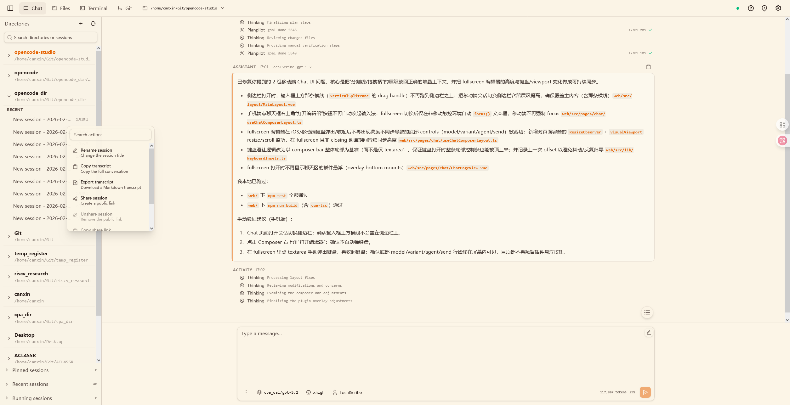
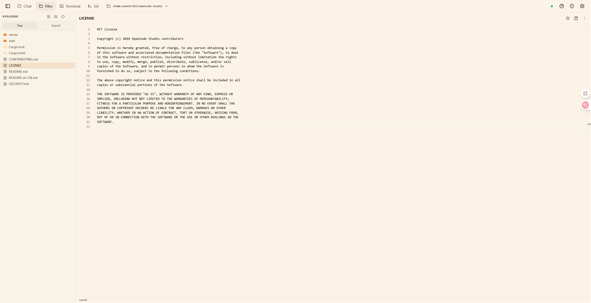
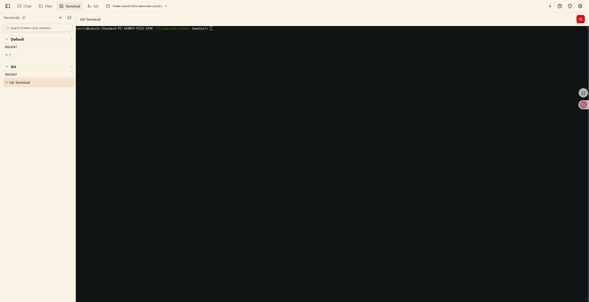
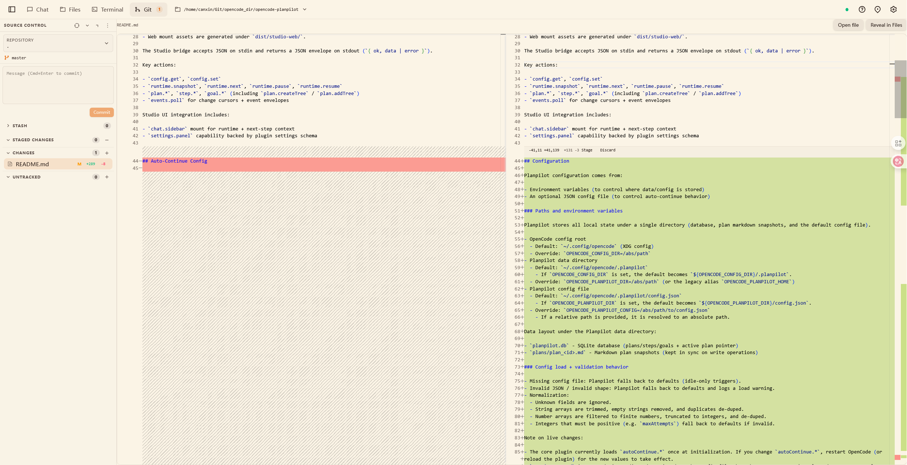
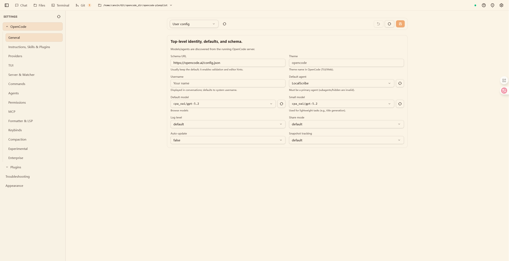

# OpenCode Studio

[English](../../../README.md) | 简体中文

<p align="center">
  
</p>

<p align="center">
  <strong>专注高效工作流的 OpenCode 一体化工作台。</strong><br />
  聊天、文件、终端、Git、设置统一在一个界面。<br />
  既适合本机快速使用，也支持服务模式稳定常驻。
</p>

<p align="center">
  <a href="https://github.com/canxin121/opencode-studio/releases/latest">下载发布版</a>
  ·
  <a href="../../technical-reference.md">技术文档</a>
  ·
  <a href="../../service.md">服务安装</a>
  ·
  <a href="https://github.com/canxin121/opencode-studio/issues">问题反馈</a>
</p>

<p align="center">
  
  
  
  
  
</p>

> 说明：本项目为社区实现，非 OpenCode 团队官方项目，与其不存在官方隶属关系。OpenCode 上游项目：[anomalyco/opencode](https://github.com/anomalyco/opencode)

<a id="contents"></a>
## 目录

- [为什么选择 OpenCode Studio](#why-opencode-studio)
- [页面预览](#ui-preview)
- [快速开始（2 分钟）](#quick-start)
- [安装细节](#installation-details)
- [安装后](#after-install)
- [服务管理](#service-management)
- [技术细节与参数](#technical-details-and-parameters)
- [License](#license)

<a id="why-opencode-studio"></a>
## 为什么选择 OpenCode Studio

- 多面板协同：聊天、文件、终端、Git 在一个工作区内联动。
- OpenCode 事件流桥接：支持实时流式消息和会话恢复。
- 性能优化链路：代理层会做事件裁剪与结果精简，降低长会话压力。
- 分页优先机制：核心列表统一使用 `offset` / `limit`，减轻首屏负载。
- 懒加载策略：较重内容按需请求和渲染，减少无效加载。
- 独有插件 UI 系统：从 `opencode.json` 发现插件，加载 `studio.manifest.json` 并在 UI 中提供动作入口。
- 本地优先且可运维：可选择桌面安装包即开即用，也可按服务模式稳定常驻。

<a id="ui-preview"></a>
## 页面预览

<p align="center">
  <a href="../../../assets/studio-chat.png"></a>
  <a href="../../../assets/studio-files.png"></a>
  <a href="../../../assets/studio-terminal.png"></a>
</p>
<p align="center">
  <a href="../../../assets/studio-git.png"></a>
  <a href="../../../assets/studio-settings.png"></a>
</p>

- 聊天页面：会话管理、消息流、工具调用可视化。
- 文件页面：工作区浏览、编辑、搜索/替换。
- 终端页面：集成 PTY 终端，支持常见命令操作。
- Git 页面：状态查看、差异对比、分支/worktree 辅助。
- 设置页面：OpenCode 配置层与 Studio 本地配置集中管理。

<a id="quick-start"></a>
## 快速开始（2 分钟）

1. 先安装 OpenCode CLI（任选一种方式）。

```bash
# macOS / Linux（官方安装脚本）
curl -fsSL https://opencode.ai/install | bash

# macOS / Linux（Homebrew）
brew install anomalyco/tap/opencode
```

```powershell
# Windows（Scoop）
scoop install opencode

# Windows（Chocolatey）
choco install opencode

# 任意平台（已安装 Bun）
bun add -g opencode-ai@latest
```

2. 确认安装成功。

```bash
opencode --version
```

3. 选择安装方式。

| 场景 | 推荐方式 | 结果 |
| --- | --- | --- |
| 本机桌面使用 | 安装包安装 | 原生桌面应用，内置后端服务自动启动 |
| 常驻主机 / 服务器场景 | 服务安装 | 通过 `systemd`、`launchd` 或 Windows SCM 统一管理 |

4. 浏览器访问：
- 含前端安装：`http://127.0.0.1:3210`
- 仅 API 安装：`http://127.0.0.1:3210/health`

<a id="installation-details"></a>
## 安装细节

### 方式一：安装包安装（Desktop App）

适合本机桌面使用。

1. 打开 [GitHub Releases 页面](https://github.com/canxin121/opencode-studio/releases/latest)
2. 按系统下载安装包：
   - Windows：`.msi` / `.exe`
   - macOS：`.dmg`
   - Linux：`.AppImage` / `.deb` / `.rpm`
3. 安装并启动应用后，内置后端服务会自动启动。

### 方式二：服务安装（Service）

适合服务器、开发机常驻、或需要用 `systemd` / `launchd` / `sc` 统一管理的场景（Windows 由 SCM + NSSM 包装运行服务进程）。

Windows 安装脚本会注册两个服务：
- `OpenCodeStudio-OpenCode`（托管 `opencode serve`，端口 `16000`）
- `OpenCodeStudio`（Web/API 服务，依赖 `OpenCodeStudio-OpenCode`）

Unix（Linux/macOS）：

```bash
# 服务安装（含内置 UI）
curl -fsSL https://raw.githubusercontent.com/canxin121/opencode-studio/master/scripts/install-service.sh | bash -s -- --with-frontend

# 服务安装（仅 API，不带内置 UI）
curl -fsSL https://raw.githubusercontent.com/canxin121/opencode-studio/master/scripts/install-service.sh | bash

# 服务安装（自定义监听地址 / 端口 / 密码）
curl -fsSL https://raw.githubusercontent.com/canxin121/opencode-studio/master/scripts/install-service.sh | bash -s -- --with-frontend --host 0.0.0.0 --port 3210 --ui-password "change-me"
```

Windows PowerShell（管理员权限）：

```powershell
# 服务安装（含内置 UI）
iex "& { $(irm https://raw.githubusercontent.com/canxin121/opencode-studio/master/scripts/install-service.ps1) } -WithFrontend"

# 服务安装（仅 API，不带内置 UI）
iex "& { $(irm https://raw.githubusercontent.com/canxin121/opencode-studio/master/scripts/install-service.ps1) }"

# 服务安装（自定义监听地址 / 端口 / 密码）
iex "& { $(irm https://raw.githubusercontent.com/canxin121/opencode-studio/master/scripts/install-service.ps1) } -WithFrontend -Host 0.0.0.0 -Port 3210 -UiPassword 'change-me'"
```

<a id="after-install"></a>
## 安装后

### 浏览器访问

- 服务默认地址是 `http://127.0.0.1:3210`（由配置里的 `host` + `port` 决定）。
- 默认认证密码为空（`ui_password = ""`），即默认不启用密码登录。
- 如果是“含内置 UI”安装，直接打开 `http://127.0.0.1:3210`。
- 如果是“仅 API”安装，可访问 `http://127.0.0.1:3210/health` 验证服务状态。
- 仅 API 模式想启用网页 UI，可在 `opencode-studio.toml` 中设置 `ui_dir` 指向有效 `dist` 目录，或重新使用 `--with-frontend` / `-WithFrontend` 安装。
- 需要远程机器访问时，把 `host` 改为 `0.0.0.0`，重启服务后通过 `http://<服务器IP>:3210` 访问。

### 调整配置

服务安装完成后会生成 `opencode-studio.toml`：
- Unix：`~/opencode-studio/opencode-studio.toml`
- Windows：`%USERPROFILE%\\opencode-studio\\opencode-studio.toml`

可修改 `[backend]` 下关键项：

```toml
[backend]
host = "127.0.0.1"
port = 3210
ui_password = ""
skip_opencode_start = false
opencode_host = "127.0.0.1"
# opencode_port = 16000
# ui_dir = "/absolute/path/to/web/dist"
```

Windows 服务安装默认写入 `skip_opencode_start = true`，以提高 SCM 下的启动稳定性。安装脚本还会写入 `opencode_port = 16000`，并自动托管 `OpenCodeStudio-OpenCode` 伴随服务。

修改后重启服务生效：
- Linux 用户服务：`systemctl --user restart opencode-studio`
- Linux 系统服务：`sudo systemctl restart opencode-studio`
- Windows 服务：`sc stop OpenCodeStudio` 后执行 `sc start OpenCodeStudio`

安装包模式下，配置文件位于应用数据目录；可通过托盘菜单直接打开配置文件（Open Config）进行修改。

<a id="service-management"></a>
## 服务管理

以下命令适用于“服务安装”模式。

<details>
<summary><strong>Linux（默认 user 模式）</strong></summary>

```bash
# 状态 / 启动 / 停止 / 重启
systemctl --user status opencode-studio
systemctl --user start opencode-studio
systemctl --user stop opencode-studio
systemctl --user restart opencode-studio

# 登录自启动
systemctl --user enable opencode-studio
systemctl --user disable opencode-studio

# 卸载服务单元
curl -fsSL https://raw.githubusercontent.com/canxin121/opencode-studio/master/scripts/uninstall-service.sh | bash

# 卸载服务单元 + 删除安装文件
curl -fsSL https://raw.githubusercontent.com/canxin121/opencode-studio/master/scripts/uninstall-service.sh | bash -s -- --remove-install-dir
```

</details>

<details>
<summary><strong>Linux（--mode system 安装）</strong></summary>

```bash
# 状态 / 启动 / 停止 / 重启
sudo systemctl status opencode-studio
sudo systemctl start opencode-studio
sudo systemctl stop opencode-studio
sudo systemctl restart opencode-studio

# 开机自启动
sudo systemctl enable opencode-studio
sudo systemctl disable opencode-studio

# 卸载服务单元
curl -fsSL https://raw.githubusercontent.com/canxin121/opencode-studio/master/scripts/uninstall-service.sh | bash

# 卸载服务单元 + 删除安装文件
curl -fsSL https://raw.githubusercontent.com/canxin121/opencode-studio/master/scripts/uninstall-service.sh | bash -s -- --remove-install-dir
```

</details>

<details>
<summary><strong>macOS（launchd，标签：cn.cxits.opencode-studio）</strong></summary>

```bash
# 状态
launchctl list | grep opencode

# 重启
launchctl kickstart -k gui/$(id -u)/cn.cxits.opencode-studio

# 关闭自启动（卸载 agent）
launchctl unload "$HOME/Library/LaunchAgents/cn.cxits.opencode-studio.plist"

# 重新开启自启动（加载 agent）
launchctl load "$HOME/Library/LaunchAgents/cn.cxits.opencode-studio.plist"

# 卸载服务 agent
curl -fsSL https://raw.githubusercontent.com/canxin121/opencode-studio/master/scripts/uninstall-service.sh | bash

# 卸载服务 agent + 删除安装文件
curl -fsSL https://raw.githubusercontent.com/canxin121/opencode-studio/master/scripts/uninstall-service.sh | bash -s -- --remove-install-dir
```

</details>

<details>
<summary><strong>Windows（服务名：OpenCodeStudio-OpenCode、OpenCodeStudio）</strong></summary>

```powershell
# 状态 / 启动 / 停止 / 重启
sc query OpenCodeStudio-OpenCode
sc query OpenCodeStudio
sc start OpenCodeStudio-OpenCode
sc start OpenCodeStudio
sc stop OpenCodeStudio
sc stop OpenCodeStudio-OpenCode
sc stop OpenCodeStudio; sc start OpenCodeStudio

# 开机自启动
sc config OpenCodeStudio-OpenCode start= auto
sc config OpenCodeStudio start= auto

# 关闭自启动
sc config OpenCodeStudio start= demand
sc config OpenCodeStudio-OpenCode start= demand

# 卸载服务
iex "& { $(irm https://raw.githubusercontent.com/canxin121/opencode-studio/master/scripts/uninstall-service.ps1) }"

# 卸载服务 + 删除安装文件
iex "& { $(irm https://raw.githubusercontent.com/canxin121/opencode-studio/master/scripts/uninstall-service.ps1) } -RemoveInstallDir"
```

</details>

<a id="technical-details-and-parameters"></a>
## 技术细节与参数

技术栈、目录结构、CLI/环境变量参数、安装脚本参数、连接外部 OpenCode、开发命令等统一放在：

- [`docs/technical-reference.md`](../../technical-reference.md)

补充文档：
- [`docs/service.md`](../../service.md)（服务安装/卸载细节）
- [`docs/packaging.md`](../../packaging.md)（安装包与构建产物说明）
- [`desktop/README.md`](../../../desktop/README.md)（桌面打包说明）
- [`docs/opencode-studio.toml.example`](../../opencode-studio.toml.example)（配置模板）
- [`docs/backend-accel-parity-review.md`](../../backend-accel-parity-review.md)（后端加速一致性评审）
- [`SECURITY.md`](../../../SECURITY.md)（安全说明）
- [`CONTRIBUTING.md`](../../../CONTRIBUTING.md)（贡献指南）

## License

本项目采用 MIT License，详见 [`LICENSE`](../../../LICENSE)。
